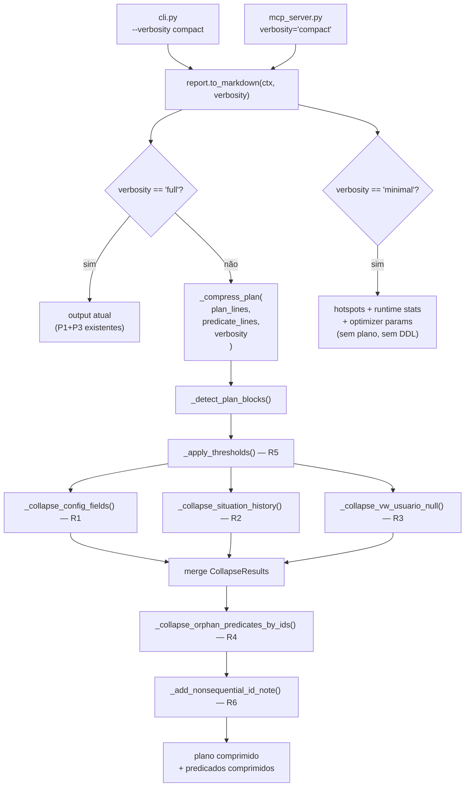
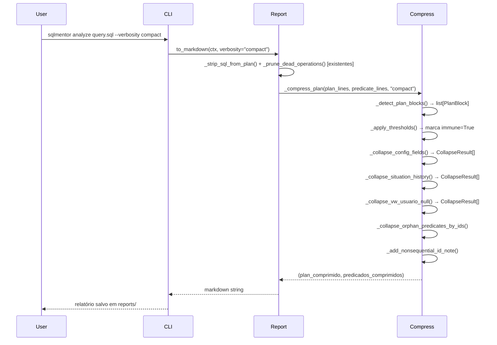

# Design Document: plan-compression

## Overview

Reduz o tamanho dos relatórios gerados pelo SqlMentor em ~40% adicionais (de ~2.283 para ~1.400 linhas em casos como `VW_ENTITY_A_DETAIL`) sem distorcer a análise de performance. A compressão é controlada por um parâmetro `verbosity` (`full` | `compact` | `minimal`) que ativa conjuntos coerentes de podas — nenhuma omissão é silenciosa, toda poda gera um bloco de resumo com custo agregado.

O `collector.py` não muda — ele coleta tudo. O `report.py` decide o que mostrar. CLI e MCP Server recebem o parâmetro `verbosity` e o repassam para `to_markdown`.

## Architecture



## Sequence Diagrams

### Fluxo compact — relatório com compressão ativa



## Components and Interfaces

### Component: `_compress_plan`

**Purpose**: Orquestrador principal — recebe o plano bruto e retorna versão comprimida.

**Interface**:
```python
def _compress_plan(
    plan_lines: list[str],
    predicate_lines: list[str],
    verbosity: str,
) -> tuple[list[str], list[str]]:
    ...
```

**Responsabilidades**:
- Retorna `(plan_lines, predicate_lines)` sem modificação se `verbosity == "full"`
- Orquestra R1–R6 em sequência determinística
- Garante que nenhum bloco imune (R5) seja colapsado

---

### Component: `_detect_plan_blocks`

**Purpose**: Parseia o texto fixo do Oracle em estrutura navegável.

**Interface**:
```python
def _detect_plan_blocks(plan_lines: list[str]) -> list[PlanBlock]:
    ...
```

**Responsabilidades**:
- Extrai campos numéricos via regex `_PLAN_ROW`
- Preserva indentação em `PlanBlock.indent` para inferir hierarquia pai/filho
- Converte sufixos K/M/G de buffers para inteiro

---

### Component: `_apply_thresholds`

**Purpose**: Marca operações imunes a colapso (R5).

**Interface**:
```python
def _apply_thresholds(blocks: list[PlanBlock]) -> None:
    ...
```

**Thresholds** (mutação in-place em `block.immune`):

| Critério | Threshold |
|----------|-----------|
| `reads > 0` | Acesso a disco — sempre relevante |
| `buffers > 1.000` | Custo real de I/O lógico |
| `starts > 100` | Efeito multiplicador |
| `a_time_ms > 100ms` | Operação lenta |
| `max(e_rows, a_rows) / min > 10x` | Desvio de cardinalidade |

---

### Component: `_collapse_config_fields` (R1)

**Purpose**: Colapsa grupos de scalar subqueries de campos configurados por obra.

**Interface**:
```python
def _collapse_config_fields(blocks: list[PlanBlock]) -> list[CollapseResult]:
    ...
```

**Critério de detecção**:
- Operação raiz: `SORT AGGREGATE` com `starts == 1`
- Filhos (indent maior) contêm `IDX_ATTR_ENTITY_ID` e `PK_ATTR_CONFIG`
- Grupo de ≥ 3 blocos consecutivos com mesmo padrão
- Nenhum bloco do grupo é `immune`

**Saída**:
```
[COLAPSADO: N scalar subqueries — campos configurados por obra]
  Índices: IDX_ATTR_ENTITY_ID → PK_ATTR_CONFIG
  Resultado: A-Rows=0 em todos
  Custo total: X buffers, Y reads
  ⚠️ Em obras com campos configurados, esses blocos terão custo real.
```

---

### Component: `_collapse_situation_history` (R2)

**Purpose**: Colapsa scalar subqueries `DATA_ALT_SIT_*` com tabela resumo por tipo.

**Interface**:
```python
def _collapse_situation_history(
    blocks: list[PlanBlock],
    predicate_map: dict[str, list[str]],
) -> list[CollapseResult]:
    ...
```

**Critério de detecção**:
- Operação raiz: `SORT AGGREGATE` com `starts == 1`
- Filhos contêm `UK_STATUS_TYPE_REF` e `IDX_STATUS_HIST_ENTITY`
- Grupo de ≥ 2 blocos consecutivos
- `TYPE_REF` extraído dos predicados via regex

**Saída** (tabela preserva A-Rows por tipo — informação relevante):
```
[COLAPSADO: 8 scalar subqueries DATA_ALT_SIT_* — histórico de situações]
  Padrão: UK_STATUS_TYPE_REF → IDX_STATUS_HIST_ENTITY
  | Tipo | A-Rows | Buffers |
  |------|--------|---------|
  | STATUS_ACTIVE | 3 | 10 |
  ...
  Custo total: 80 buffers
```

---

### Component: `_collapse_vw_usuario_null` (R3)

**Purpose**: Colapsa expansões de `VW_CURRENT_USER` quando o resultado é NULL nesta execução.

**Interface**:
```python
def _collapse_vw_usuario_null(blocks: list[PlanBlock]) -> list[CollapseResult]:
    ...
```

**Critério de detecção**:
- Nó `VIEW` com nome `VW_CURRENT_USER` ou `FROM$_SUBQUERY$_*`
- `a_rows == 0` no nó VIEW
- Nenhum nó da subárvore é `immune`

**Saída**:
```
[COLAPSADO: VW_CURRENT_USER para <campo> — A-Rows=0, X buffers — usuário NULL nesta execução]
  ⚠️ Quando o usuário não é NULL, esta subárvore pode ter custo significativo.
```

---

### Component: `_collapse_orphan_predicates_by_ids` (R4)

**Purpose**: Remove predicados cujos IDs foram colapsados por R1/R2/R3.

**Interface**:
```python
def _collapse_orphan_predicates_by_ids(
    plan_lines: list[str],
    collapsed_ids: set[str],
) -> list[str]:
    ...
```

**Comportamento**: Quando um bloco é colapsado, seus predicados na seção `Predicate Information` também são removidos. Adiciona nota `(N predicados de blocos colapsados omitidos — ver resumos acima)`.

---

### Component: `_add_nonsequential_id_note` (R6)

**Purpose**: Adiciona nota explicativa quando IDs do plano têm saltos.

**Interface**:
```python
def _add_nonsequential_id_note(plan_lines: list[str]) -> list[str]:
    ...
```

**Detecção**: Salto > 1 entre IDs consecutivos no plano.

**Saída** (inserida após `Plan hash value`):
```
ℹ️ IDs não sequenciais são normais — operações internas de views/subqueries
   são numeradas pelo Oracle mas omitidas do DBMS_XPLAN.
```

## Data Models

### `PlanBlock`

```python
@dataclass
class PlanBlock:
    id: str
    operation: str
    name: str
    starts: int
    e_rows: int | None      # None quando Oracle não estima (ex: SORT AGGREGATE)
    a_rows: int
    a_time_ms: float        # convertido de HH:MM:SS.ss
    buffers: int            # convertido de K/M/G para inteiro
    reads: int
    indent: int = 0         # espaços de indentação — proxy para profundidade na árvore
    immune: bool = False    # True = nunca colapsar (R5)
    children: list["PlanBlock"] = field(default_factory=list)
```

**Regras de validação**:
- `starts >= 0`, `a_rows >= 0`, `buffers >= 0`, `reads >= 0`
- `indent >= 0`
- `immune` é derivado — nunca setado pelo caller, só por `_apply_thresholds`

---

### `CollapseResult`

```python
@dataclass
class CollapseResult:
    collapsed_ids: set[str]       # IDs das linhas do plano que foram removidas
    replacement_lines: list[str]  # linhas do bloco de resumo que as substituem
```

---

### Regex principal de parsing

```python
_PLAN_ROW = re.compile(
    r'\|\*?\s*(\d+)\s*\|'           # grupo 1: Id
    r'(\s*)(\S[^|]*?)\s*\|'         # grupo 2: indent_spaces, grupo 3: Operation
    r'\s*(.*?)\s*\|'                 # grupo 4: Name
    r'\s*(\d+)\s*\|'                 # grupo 5: Starts
    r'\s*(\d*)\s*\|'                 # grupo 6: E-Rows (pode estar vazio)
    r'\s*(\d+)\s*\|'                 # grupo 7: A-Rows
    r'\s*(\d+:\d+:\d+\.\d+)\s*\|'  # grupo 8: A-Time
    r'\s*(\d+[KMG]?)\s*\|'          # grupo 9: Buffers
    r'\s*(\d+)\s*\|',               # grupo 10: Reads
)
```

---

### Parâmetro `verbosity`

| Valor | Comportamento |
|-------|---------------|
| `full` | Sem compressão além de P1/P3 já existentes. Output idêntico ao atual. |
| `compact` | Todas as podas R1–R6 ativas. **Default novo.** |
| `minimal` | Só hotspots + runtime stats + optimizer params. Sem plano, sem DDL. |

**Breaking change controlado**: o comportamento atual vira `full`. O default novo é `compact`.

## Algorithmic Pseudocode

### Algoritmo principal: `_compress_plan`

```pascal
ALGORITHM _compress_plan(plan_lines, predicate_lines, verbosity)
INPUT:  plan_lines: list[str], predicate_lines: list[str], verbosity: str
OUTPUT: (plan_comprimido: list[str], predicados_comprimidos: list[str])

BEGIN
  IF verbosity = "full" THEN
    RETURN (plan_lines, predicate_lines)
  END IF

  blocks ← _detect_plan_blocks(plan_lines)
  _apply_thresholds(blocks)                    -- mutação in-place
  pred_map ← _build_predicate_map(plan_lines)

  -- Coleta todos os colapsos em sequência
  collapses ← []
  collapses ← collapses + _collapse_config_fields(blocks)
  collapses ← collapses + _collapse_situation_history(blocks, pred_map)
  collapses ← collapses + _collapse_vw_usuario_null(blocks)

  -- União de todos os IDs colapsados
  all_collapsed_ids ← ∅
  FOR each cr IN collapses DO
    all_collapsed_ids ← all_collapsed_ids ∪ cr.collapsed_ids
  END FOR

  IF all_collapsed_ids = ∅ THEN
    RETURN (_add_nonsequential_id_note(plan_lines), predicate_lines)
  END IF

  -- Reconstrói o plano substituindo blocos colapsados pelos resumos
  id_to_collapse ← {id: cr FOR cr IN collapses FOR id IN cr.collapsed_ids}
  new_plan ← []
  emitted ← ∅  -- set de CollapseResult já emitidos (evita duplicar resumo)

  FOR each line IN plan_lines DO
    id ← extract_id(line)  -- None se linha não é operação do plano
    IF id ∈ all_collapsed_ids THEN
      cr ← id_to_collapse[id]
      IF cr ∉ emitted THEN
        new_plan ← new_plan + cr.replacement_lines
        emitted ← emitted ∪ {cr}
      END IF
      -- pula linha original
    ELSE
      new_plan ← new_plan + [line]
    END IF
  END FOR

  new_plan ← _add_nonsequential_id_note(new_plan)
  new_preds ← _collapse_orphan_predicates_by_ids(predicate_lines, all_collapsed_ids)

  RETURN (new_plan, new_preds)
END
```

**Precondições**:
- `plan_lines` é output válido de `_strip_sql_from_plan` + `_prune_dead_operations`
- `verbosity ∈ {"full", "compact", "minimal"}`

**Postcondições**:
- Se `verbosity = "full"`: output idêntico ao input
- Se `verbosity = "compact"`: todo ID em `all_collapsed_ids` está ausente do `new_plan`
- Todo colapso gera exatamente um bloco de resumo (não duplica)
- Predicados de IDs colapsados são removidos de `new_preds`

**Invariante do loop de reconstrução**:
- `emitted` cresce monotonicamente — um `CollapseResult` é emitido no máximo uma vez

---

### Algoritmo: `_apply_thresholds`

```pascal
ALGORITHM _apply_thresholds(blocks)
INPUT:  blocks: list[PlanBlock]
OUTPUT: void (mutação in-place de block.immune)

PRECONDITION: blocks é lista plana de PlanBlock com campos numéricos válidos

BEGIN
  FOR each block IN blocks DO
    ASSERT block.reads >= 0 AND block.buffers >= 0

    IF block.reads > 0 THEN
      block.immune ← true
      CONTINUE
    END IF
    IF block.buffers > THRESHOLD_BUFFERS THEN  -- 1.000
      block.immune ← true
      CONTINUE
    END IF
    IF block.starts > THRESHOLD_STARTS THEN    -- 100
      block.immune ← true
      CONTINUE
    END IF
    IF block.a_time_ms > THRESHOLD_ATIME_MS THEN  -- 100ms
      block.immune ← true
      CONTINUE
    END IF
    IF block.e_rows ≠ null AND block.e_rows > 0 AND block.a_rows > 0 THEN
      ratio ← max(block.e_rows, block.a_rows) / min(block.e_rows, block.a_rows)
      IF ratio > CARDINALITY_RATIO THEN  -- 10x
        block.immune ← true
      END IF
    END IF
  END FOR
END
```

**Postcondição**: Para todo `block` em `blocks`, `block.immune = true` se e somente se pelo menos um threshold foi atingido.

---

### Algoritmo: detecção de grupos (padrão comum a R1 e R2)

```pascal
ALGORITHM detect_consecutive_groups(blocks, root_op, target_indexes)
INPUT:  blocks: list[PlanBlock]
        root_op: str  -- ex: "SORT AGGREGATE"
        target_indexes: set[str]  -- índices que devem aparecer nos filhos
OUTPUT: groups: list[list[PlanBlock]]

BEGIN
  groups ← []
  current_group ← []
  current_root_ids ← []

  i ← 0
  WHILE i < len(blocks) DO
    b ← blocks[i]

    IF b.operation = root_op AND b.starts = 1 THEN
      -- Coleta filhos (indent maior que o root)
      j ← i + 1
      child_names ← ∅
      child_blocks ← [b]
      WHILE j < len(blocks) AND blocks[j].indent > b.indent DO
        child_names ← child_names ∪ {blocks[j].name.upper()}
        child_blocks ← child_blocks + [blocks[j]]
        j ← j + 1
      END WHILE

      IF target_indexes ⊆ child_names THEN
        -- Candidato ao grupo
        current_group ← current_group + child_blocks
        current_root_ids ← current_root_ids + [b.id]
        i ← j
        CONTINUE
      ELSE
        flush(current_group, current_root_ids, groups)
        current_group ← []
        current_root_ids ← []
      END IF
    ELSE
      flush(current_group, current_root_ids, groups)
      current_group ← []
      current_root_ids ← []
    END IF

    i ← i + 1
  END WHILE

  flush(current_group, current_root_ids, groups)
  RETURN groups
END
```

**Invariante do loop**: `current_group` contém apenas blocos consecutivos que satisfazem o critério de detecção.

## Key Functions with Formal Specifications

### `to_markdown(ctx, verbosity)`

```python
def to_markdown(ctx: CollectedContext, verbosity: str = "compact") -> str:
```

**Precondições**:
- `ctx` é `CollectedContext` válido (não None)
- `verbosity ∈ {"full", "compact", "minimal"}`

**Postcondições**:
- Levanta `ValueError` se `verbosity` não é um dos três valores válidos
- Se `verbosity = "full"`: output é idêntico ao comportamento anterior à feature
- Se `verbosity = "compact"`: output tem menos linhas que `full` para planos com views complexas
- Se `verbosity = "minimal"`: output contém apenas hotspots, runtime stats e optimizer params

**Loop invariants**: N/A (função de formatação sem loops de estado)

---

### `_detect_plan_blocks(plan_lines)`

```python
def _detect_plan_blocks(plan_lines: list[str]) -> list[PlanBlock]:
```

**Precondições**:
- `plan_lines` é lista de strings (pode ser vazia)

**Postcondições**:
- Retorna lista de `PlanBlock` na mesma ordem das linhas do plano
- Linhas que não casam com `_PLAN_ROW` são ignoradas (sem erro)
- `len(result) ≤ len(plan_lines)`
- Para todo `block` em resultado: `block.buffers ≥ 0`, `block.reads ≥ 0`, `block.starts ≥ 0`

---

### `_collapse_config_fields(blocks)`

```python
def _collapse_config_fields(blocks: list[PlanBlock]) -> list[CollapseResult]:
```

**Precondições**:
- `_apply_thresholds` já foi chamado (campos `immune` estão setados)

**Postcondições**:
- Para todo `CollapseResult` retornado: `len(cr.collapsed_ids) ≥ 3`
- Nenhum `block.immune = True` aparece em qualquer `cr.collapsed_ids`
- `cr.replacement_lines` contém exatamente uma linha `[COLAPSADO: ...]`

---

### `_collapse_orphan_predicates_by_ids(plan_lines, collapsed_ids)`

```python
def _collapse_orphan_predicates_by_ids(
    plan_lines: list[str],
    collapsed_ids: set[str],
) -> list[str]:
```

**Precondições**:
- `collapsed_ids` é o conjunto union de todos os `cr.collapsed_ids`

**Postcondições**:
- Nenhuma linha de predicado com ID em `collapsed_ids` aparece no resultado
- Se `pruned > 0`: última linha do resultado é a nota de omissão
- Se `collapsed_ids = ∅`: retorna `plan_lines` sem modificação

## Example Usage

```python
# Uso básico — compact é o default
report = to_markdown(ctx)

# Full — comportamento legado, sem compressão adicional
report = to_markdown(ctx, verbosity="full")

# Minimal — só o essencial para contexto rápido
report = to_markdown(ctx, verbosity="minimal")

# Validação de verbosity inválido
try:
    to_markdown(ctx, verbosity="verbose")
except ValueError as e:
    print(e)  # "verbosity inválido: 'verbose'. Use: full, compact, minimal"
```

```python
# Uso via CLI
# sqlmentor analyze query.sql --conn prod --verbosity compact
# sqlmentor inspect abc123xyz --conn prod --verbosity minimal

# Uso via MCP
# analyze_sql(sql="SELECT ...", conn="prod", verbosity="compact")
# inspect_sql(sql_id="abc123xyz", conn="prod", verbosity="full")
```

## Correctness Properties

*A property is a characteristic or behavior that should hold true across all valid executions of a system — essentially, a formal statement about what the system should do. Properties serve as the bridge between human-readable specifications and machine-verifiable correctness guarantees.*

### Property 1: Idempotência de `full`

*Para qualquer* `CollectedContext` válido, `to_markdown(ctx, "full")` produz output idêntico ao comportamento anterior à feature (sem compressão adicional).

**Validates: Requirements 1.2, 9.2**

---

### Property 2: Monotonicidade de compressão

*Para qualquer* `CollectedContext` válido, o número de linhas do output satisfaz `len(minimal) ≤ len(compact) ≤ len(full)`.

**Validates: Requirements 1.3, 1.4**

---

### Property 3: Nenhuma poda silenciosa

*Para todo* `CollapseResult` gerado por qualquer regra R1–R3, `len(cr.replacement_lines) ≥ 1` e a primeira linha começa com `[COLAPSADO:`.

**Validates: Requirements 4.4, 5.4, 6.3**

---

### Property 4: Imunidade preservada

*Para qualquer* lista de `PlanBlock` e qualquer combinação de regras R1–R3, nenhum bloco com `immune = True` aparece em `collapsed_ids` de nenhum `CollapseResult`.

**Validates: Requirements 3.7, 4.2, 5.2, 6.2**

---

### Property 5: Consistência de predicados

*Para qualquer* conjunto `collapsed_ids` não-vazio, nenhuma linha de predicado com ID em `collapsed_ids` aparece no output de `_collapse_orphan_predicates_by_ids`; todas as linhas com ID fora de `collapsed_ids` são preservadas.

**Validates: Requirements 7.1, 7.4**

---

### Property 6: Verbosity inválido levanta erro

*Para qualquer* string que não seja `"full"`, `"compact"` ou `"minimal"`, `to_markdown(ctx, verbosity=s)` levanta `ValueError`.

**Validates: Requirements 1.5**

---

### Property 7: Grupos mínimos

*Para qualquer* lista de blocos, `_collapse_config_fields` nunca retorna `CollapseResult` com `len(collapsed_ids) < 3`; `_collapse_situation_history` nunca retorna `CollapseResult` com `len(collapsed_ids) < 2`.

**Validates: Requirements 4.3, 5.3**

---

### Property 8: Thresholds determinísticos

*Para qualquer* `PlanBlock`, `_apply_thresholds` marca `immune = True` se e somente se pelo menos um dos critérios (reads > 0, buffers > 1000, starts > 100, a_time_ms > 100, desvio de cardinalidade > 10x) é satisfeito.

**Validates: Requirements 3.1, 3.2, 3.3, 3.4, 3.5, 3.6**

---

### Property 9: Round-trip de PlanBlock

*Para qualquer* `PlanBlock` válido, parsear → formatar → parsear produz um objeto equivalente ao original.

**Validates: Requirements 2.7**

---

### Property 10: IDs colapsados ausentes do plano reconstruído

*Para qualquer* execução de `_compress_plan` com `verbosity != "full"`, nenhum ID em `all_collapsed_ids` aparece no plano reconstruído, e cada `CollapseResult` emite exatamente um bloco de resumo (sem duplicação).

**Validates: Requirements 9.3, 9.5**

---

### Property 11: Robustez de _compress_plan

*Para qualquer* lista de strings como `plan_lines` e `predicate_lines` e qualquer `verbosity` válido, `_compress_plan` nunca levanta exceção e retorna `(list[str], list[str])`.

**Validates: Requirements 9.6**

---

### Property 12: Nota de IDs não sequenciais

*Para qualquer* plano com salto > 1 entre IDs consecutivos, `_add_nonsequential_id_note` insere a nota; para planos com IDs sequenciais, não insere nenhuma nota adicional.

**Validates: Requirements 8.1, 8.2**

## Error Handling

### Verbosity inválido

**Condição**: `verbosity` não é `"full"`, `"compact"` ou `"minimal"`
**Resposta**: `ValueError` com mensagem clara listando os valores aceitos
**Recovery**: Caller (CLI/MCP) captura e exibe erro ao usuário

### Plano sem linhas parseáveis

**Condição**: `_detect_plan_blocks` retorna lista vazia (plano não tem formato ALLSTATS)
**Resposta**: `_compress_plan` retorna `(plan_lines, predicate_lines)` sem modificação
**Recovery**: Transparente — o plano original é exibido integralmente

### Grupo com bloco imune

**Condição**: Um bloco candidato a colapso tem `immune = True`
**Resposta**: O grupo inteiro é descartado — nenhum bloco do grupo é colapsado
**Recovery**: Todos os blocos do grupo aparecem no output expandido

### Predicate map vazio

**Condição**: `_build_predicate_map` retorna `{}` (plano sem seção Predicate Information)
**Resposta**: `_collapse_situation_history` não consegue extrair `TYPE_REF` — usa `"?"` como fallback
**Recovery**: Colapso ainda ocorre, tabela resumo mostra `?` na coluna Tipo

## Testing Strategy

### Unit Testing Approach

Cada função de colapso é testada isoladamente com planos sintéticos:

- `_detect_plan_blocks`: plano simples (sem views), plano com IDs não sequenciais, linha malformada (deve ser ignorada)
- `_apply_thresholds`: cada threshold individualmente, combinação de thresholds
- `_collapse_config_fields`: grupo com ≥ 3 blocos (colapsa), grupo com bloco imune (não colapsa), grupo com A-Rows > 0 em algum (não colapsa)
- `_collapse_situation_history`: 7 tipos de situação, mix de A-Rows=0 e A-Rows>0, extração de TYPE_REF
- `_collapse_vw_usuario_null`: expansão com A-Rows=0 (colapsa), expansão com A-Rows=1 (não colapsa)
- `_collapse_orphan_predicates_by_ids`: predicados de IDs colapsados removidos, predicados de IDs mantidos preservados
- `_add_nonsequential_id_note`: IDs sequenciais (sem nota), IDs com salto (com nota)

### Property-Based Testing Approach

**Property Test Library**: `hypothesis`

Propriedades a verificar:

```python
@given(plan_lines=st.lists(st.text()), verbosity=st.sampled_from(["full", "compact", "minimal"]))
def test_compress_never_crashes(plan_lines, verbosity):
    # _compress_plan nunca levanta exceção para qualquer input
    result_plan, result_preds = _compress_plan(plan_lines, plan_lines, verbosity)
    assert isinstance(result_plan, list)

@given(ctx=valid_collected_context())
def test_full_verbosity_idempotent(ctx):
    # to_markdown com full é idêntico ao comportamento anterior
    assert to_markdown(ctx, "full") == legacy_to_markdown(ctx)

@given(ctx=valid_collected_context())
def test_compression_monotonic(ctx):
    minimal = len(to_markdown(ctx, "minimal").splitlines())
    compact = len(to_markdown(ctx, "compact").splitlines())
    full = len(to_markdown(ctx, "full").splitlines())
    assert minimal <= compact <= full

@given(blocks=st.lists(valid_plan_block()))
def test_immune_blocks_never_collapsed(blocks):
    _apply_thresholds(blocks)
    results = _collapse_config_fields(blocks) + _collapse_situation_history(blocks, {}) + _collapse_vw_usuario_null(blocks)
    all_collapsed = {id for cr in results for id in cr.collapsed_ids}
    immune_ids = {b.id for b in blocks if b.immune}
    assert all_collapsed.isdisjoint(immune_ids)
```

### Integration Testing Approach

- Teste end-to-end com plano real de `VW_ENTITY_A_DETAIL` (fixture em `tests/fixtures/`): verificar que `compact` produz < 1.500 linhas
- Teste de regressão: `full` produz output idêntico ao baseline salvo antes da feature
- Teste de sincronização CLI/MCP: ambas as interfaces aceitam `verbosity` com os três valores

## Performance Considerations

- Parsing do plano é O(n) em linhas — sem impacto perceptível mesmo para planos de 2.000+ linhas
- `_detect_plan_blocks` é chamado uma vez por `_compress_plan` — sem re-parsing
- `id_to_collapse` é um dict para lookup O(1) na reconstrução do plano
- Nenhuma operação de I/O adicional — tudo em memória sobre strings já coletadas

## Security Considerations

- Nenhuma entrada do usuário é interpolada em queries — `verbosity` é validado contra enum fixo antes de qualquer uso
- O parâmetro `verbosity` não afeta a coleta de dados (collector.py), apenas a formatação — sem superfície de ataque adicional

## Dependencies

- Sem novas dependências externas — usa apenas `re`, `dataclasses` e `typing` da stdlib Python
- `hypothesis` para property-based tests (dev dependency)
- Integração com `cli.py` via `typer.Option` e com `mcp_server.py` via parâmetro de função
